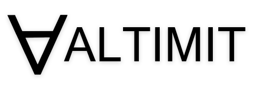

<p align="center">
    
</p>

<i>Note: This repository is being reorganized and will evolve significantly in the future.</i>

## Altimit

[Unity Package](https://github.com/meridian-xr/altimit-unity)

Altimit is a flexible and lightweight framework for building an open Metaverse. You can use Altimit as an engine for creating your own Metaverse application, or as a plugin for creating a Metaverse application in your favorite game engine or IDE. Altimit allows your application to seamlessly connect with other applications.

<details>
 <summary>
 Features Summary
 </summary>
 
## Features

### Intuitive Replication
 
 Describe the data you want synchronized between applications using basic property attributes or a fluent API. Altimit's replication system will handle the rest.
```C#
[AType]
public class User
{

    [AProperty]
    public string FirstName { get; set; }
  
    [AProperty]
    public string LastName { get; set; }
  
    [AProperty]
    public string Email { get; set; }
  
    [AProperty]
    public string Password { get; set; }
  
}
```
### Serialization
 
Data is automatically cached locally and remotely.

### Seamless RPCs
 
Calling methods on remote classes is as intuitive as calling methods on local ones.
```C#
// The interface of a server
[AType]
public interface IServer
{

    [AMethod]
    Task<User> SignIn(string email, string password);
    
    [AMethod]
    Task Logout();
    
}

// On the client:
public class Client {

    public async void SignIn(string email, string password)
    {
        var myUser = await server.SignIn(email, password);
        ...
    }

}

// On the server:
public class Server : IServer {

    public async Task<User> SignIn(string email, string password)
    {
        ... // Return a user based on the provided email and password
        return user;
    }
 
}
```
### Distributed Computing
 
Built-in mesh networking enables large-scale simulations and versatile network architectures.

### Animation
 
Create animations by specificying or recording changes in replicated data. Play back the changes.

### User Interfaces
 
Easily create complex, scalable, platform-agnostic user interfaces.
```C#
// Renders a sign-in screen on a client
[AType]
public class SignInView : View {

    [AProperty]
    string email { get; set; } = "";
  
    [AProperty]
    string password { get; set; } = "";

    protected override void Render()
    {
        AddChildren(
            new VList().AddChildren(
                new TextInput() { Placeholder = "Email" }.BindProperty(this, x=>x.email),
                new TextInput() { Placeholder = "Password", InputType = InputType.Password }.BindProperty(this, x=>x.password),
                new Button() { Label = "Sign In", OnClick = OnSignIn }
            )
        );
    }
    
    void OnSignIn()
    {
        client.SignIn(email, password);
    }
    
}

```
### Voice and Video
 
Altimit uses WebRTC to enable peer to peer connections, including voice and video streaming.

</details>

## Opening the Metaverse

<i>The logical symbol ∀ is used to represent universal quantification in predicate logic, where it is typically read as "for all".</i>

Unlike [other](https://docs.omniverse.nvidia.com/prod_kit/common/NVIDIA_Omniverse_License_Agreement.html) Metaverse frameworks, Altimit is entirely free and open source under the MIT License. Anyone is welcome to use and contribute to the framework. The goal of this project—if there is one—is to create a super accessible and useful Metaverse framework for developers and end-users. Let's make the future connected, let's make it open, and let's make it beautiful.

## Compatibility / Plugins

Altimit is available as a plugin for Godot, Unity, native Windows and native Linux. Support is planned for native macOS and native iOS in the near future. If you'd like to see support for another platform or language, please consider contributing to the project.

 <i>As of now, C# is the primary language supported.</i>
 
Platform | Support |
--- | --- | 
Godot | Supported ✔️ |
Unity | Supported ✔️ |
Native Web | Planned ➡️ |
Native iOS | Pending |
Native macOS | Pending |
Native Windows | Pending |
Native Linux | Pending |
Native Android | Pending  |
Unreal | Pending |
Blender | Pending |

Language | Support |
--- | --- | 
C# | Supported ✔️ |
Javascript | Planned ➡️ |
Python | Pending |
Swift | Pending |
C++ | Pending |

## The Engine (Planned)

Altimit's Engine is an alternative to its plugins. Built on top of the Godot Engine, the Altimit Engine combines Godot's cross-platform support and open architecture with the utility of Altimit's framework. It's a fork of the main branch of the Godot Engine that includes some optimizations to provide the best possible experience of Altimit.
 
 Executables of the Altimit Engine and a repository for it will be released at a later date.

<i>Note: Whenever possible, developers are encouraged to contribute to the main branch of Godot, rather than contributing directly to Altimit's fork of the Godot Engine. This limits fragmentation between the repositories!</i>
